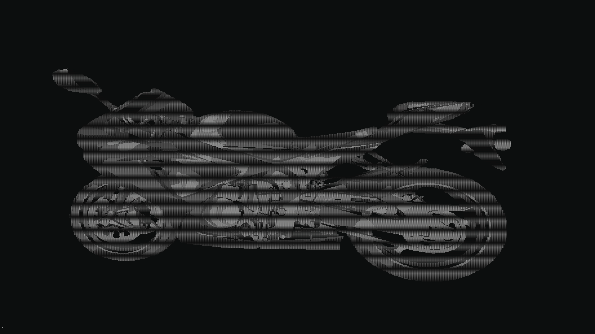

# Console 3D Rendering Engine

This repository contains three custom **software rendering engines** written in Java, implementing three different shading techniques:

- **Flat Shading**
- **Gouraud Shading**
- **Phong Shading**

## 📸 Demo

Suzuki GSX-R with Phong Shading:

---

## 🚀 Pipeline

- **Transformation stage**: 3D object transformations  
- **Application stage**: Backface culling and Frustum culling  
- **Geometry Processing stage**:  
  - Clipping  
  - Shading calculation (Flat, Gouraud, Phong)  
  - Projection  
  - Screen mapping  
- **Rasterization**: Triangle setup and traversal  
- **Pixel Shading**: Final color computation

---

## 🛠️ Tech

- **Language**: Java (no external rendering libraries)
- **Output and Rendering**: ASCII terminal rendering (cmd, wsl, etc.)

--- 

## 🔧 How to Run

⚠️ **Prerequisite:** Java JDK must be installed on your system to compile and run this engine.

1. **Clone the repository**
   ```bash
   git clone https://github.com/your-username/your-repo-name.git
   cd your-repo-name

2. **Choose the engine (Flat, Gouraud, or Phong) and navigate into its folder:**

3. **Run the demo**
  - 🐧 On WSL / Linux / macOS:
    
    Run the provided run.sh script `run.sh`  
    ```bash
     ./run.sh
    ```

  - 🪟 On Windows:

    Run the provided `run.bat` script (**double-click** or execute from terminal):
    ```bat
    run.bat  
